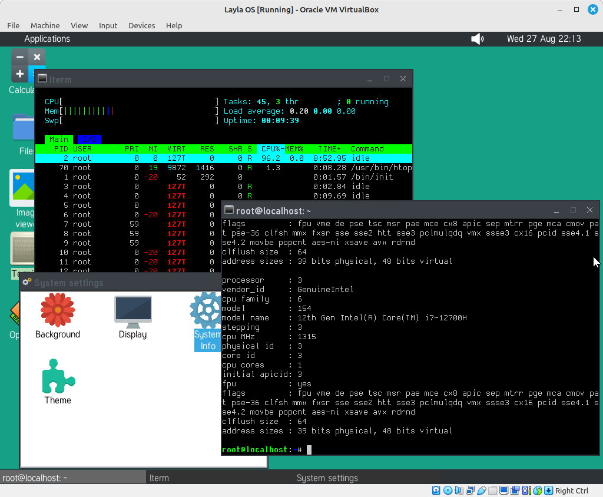

# About

LaylaOS is a hobby operating system with a kernel that is written in C. The project started around 2015 and took almost 9 years to reach a stable point where I felt it could be shared with the world.
It is meant as a learning tool to better understand the internal workings of an Operating System's kernel, how system calls work and how to implement a Graphical User Interface (GUI) environment.

It is **definitely** not a system meant for everyday use (not yet, at least).

# Screenshots

[More screenshots](screenshots)

# Features

The project's features include:
* 64 bit monolithic multitasking pre-emptive kernel written in C (the 32 bit code is included here but is not fully functional)
* Network stack (based on [PicoTCP](https://github.com/tass-belgium/picotcp/tree/master))
* ATA/ATAPI and AHCI support
* Basic Intel HDA sound support
* PS2 keyboard and mouse
* Virtual consoles
* Virtual Dynamic Shared Object ([vdso](https://man7.org/linux/man-pages/man7/vdso.7.html))
* Interprocess Communication (IPC) facilities in the form of shared memory, semaphores and message queues
* Page cache for demand loading of pages
* ACPI support via [ACPICA](https://www.intel.com/content/www/us/en/developer/topic-technology/open/acpica/download.html)
* C library (currently using [musl](https://wiki.musl-libc.org/))
* Ports of 3rd party software (GNU coreutiles, inetutils, bash, several image and audio/video decoding libraries, etc.)
* Graphical desktop with many (mostly demonstrative) applications
* [SDL2](https://www.libsdl.org/)
* [Qt5.12](https://www.qt.io/qt-5-12)
* [OpenTTD](https://www.openttd.org/)
* A fork of [SDL2 DOOM](https://github.com/moisam/laylaos-sdl2-doom/tree/master)

# TODO list

This is mostly to keep track of where we are at and what needs to be done next:
* More syscalls including POSIX message queues syscalls
* More GUI functionality (text editor, screenshot facility, paint program, desktop themes, archiver, web browser, etc.)
* VFAT, ext3, ext4, NFS filesystem support (maybe NTFS at some point)
* Kernel logging and perhaps a syslogd server
* Swap support
* USB support
* Symmetric Multiprocessing (SMP)

# Prebuilt packages

You can download a prebuilt bootable disk image that includes everything (including the ported software) from the [releases page](https://github.com/moisam/laylaos/releases).
Be mindful, however, that the unzipped disk image is likely to be big (3+ GiB in size).

See below if you want to build LaylaOS from source.

# How to build

To build LaylaOS from source:
1. Download this repository and unzip the zip file
2. Change directory to the unzipped source directory, e.g. `cd ~/downloads/laylaos-master`
3. Change directory to the `build-scripts` subdirectory in the source tree: `cd build-scripts`
4. To run the build (this **has to be done from the `build-scripts` directory**): `./buildos.sh`
5. Go grab a coffee or better yet, have some lunch. It takes a little **over 3 hours** to build the whole project!
6. Oh, and you need **internet connection** to download the sources of ported software!
7. When the build is done, create a bootable harddisk image by running: `./create_bootable_disk.sh`
8. The bootable disk image is named `bootable_disk.img` and is created by default in the current working directory (you can run `./create_bootable_disk.sh help` to see the list of options)
9. A `bochsrc` file is automatically created alongside `bootable_disk.img` (you might want to fix the name of the wireless device you use in the file). You can now run Bochs: `bochs -q`
10. Another script called `qemu.sh` is also created to let you test the OS under QEmu. However, you need a TUN/TAP network device to run LaylaOS under QEmu using the provided script. You need to first run `sudo ./netprep.sh` to create the network device, then you can proceed with running `qemu.sh`

# Licenses

- LaylaOS is released under GPL v3.
- PicoTCP (upon which our network stack is built) is released under GPL v2 or v3.
- ACPICA is released under a dual Intel and Unix-compatible licenses.
- Timidity files (needed for sound in DOOM) are in the public domain (see their `copyright.txt` file).
- The monospace font used in the system console and the GUI terminal is [Dina font](https://www.dcmembers.com/jibsen/download/61/), which is released under a free license.
- libaelf32.a and libaelf64.a are part of asmlib, the [software optimisation library](https://www.agner.org/optimize/#asmlib) by Agner Fog, which is released under GPL.
- All other ported software come with their respective licenses.
